# Proyecto 1 — API de Productos con Docker

API REST de productos para una tienda virtual, empaquetada en una imagen Docker propia
para que pueda ejecutarse en cualquier equipo sin instalar Node.js. Los datos se manejan
en memoria.

Proyectos Prácticos Finales — Docker, Git y CI/CD
Instructor: Richard Betancur — ADSO

## Tecnologías

- Node.js 22 (Alpine)
- Express 5
- Docker

## Requisitos

- Docker Desktop instalado y en ejecución
- Puerto 3000 libre en la máquina anfitriona

No se requiere Node.js instalado localmente: todo corre dentro del contenedor.

## Estructura
proyecto1-api-productos/
├── src/
│ └── index.js
├── evidencias/
├── Dockerfile
├── .dockerignore
├── .gitignore
├── package.json
└── package-lock.json


## Construcción de la imagen

```bash
docker build -t api-productos:1.0 .
```

El Dockerfile usa una construcción multietapa: la primera etapa instala las dependencias
de producción con `npm ci` y la segunda solo copia `node_modules` al runtime. La imagen
resultante pesa 237 MB frente a más de 1 GB que ocuparía una imagen `node:22` completa.

## Ejecución del contenedor

```bash
docker run -d --name api-productos -p 3000:3000 api-productos:1.0
```

- `-d` ejecuta el contenedor en segundo plano
- `--name` asigna un nombre al contenedor
- `-p 3000:3000` publica el puerto del contenedor en la máquina anfitriona

Verificar que está corriendo:

```bash
docker ps
```

## Endpoints

| Método | Ruta | Descripción | Estado |
|---|---|---|---|
| GET | `/api/health` | Verificación de estado del servicio | 200 |
| GET | `/api/productos` | Lista todos los productos | 200 |
| GET | `/api/productos/:id` | Obtiene un producto por su id | 200 / 404 |
| POST | `/api/productos` | Crea un producto | 201 / 400 |
| PUT | `/api/productos/:id` | Actualiza un producto | 200 / 404 |
| DELETE | `/api/productos/:id` | Elimina un producto | 200 / 404 |

Ejemplo de creación:

```bash
curl -X POST http://localhost:3000/api/productos \
  -H "Content-Type: application/json" \
  -d '{"nombre":"Audifonos bluetooth","precio":145000,"stock":20}'
```

## Ciclo de vida del contenedor

```bash
docker logs api-productos          # ver la salida del proceso
docker inspect api-productos       # inspeccionar la configuración
docker stop api-productos          # detener
docker ps -a                       # listar incluyendo detenidos
docker rm api-productos            # eliminar
```

Al eliminar el contenedor la imagen permanece en el sistema: son dos objetos distintos.
La imagen es la plantilla inmutable y el contenedor es una instancia en ejecución de ella.

## Evidencias

### Construcción de la imagen
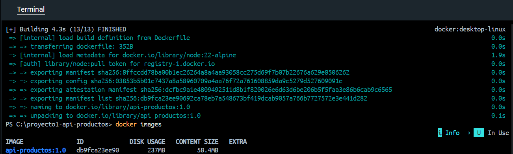

### Contenedor en ejecución
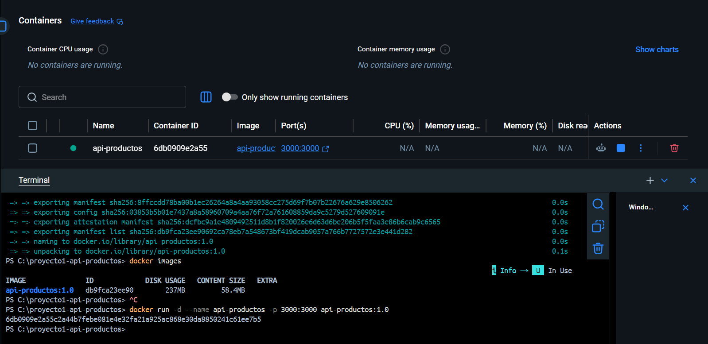
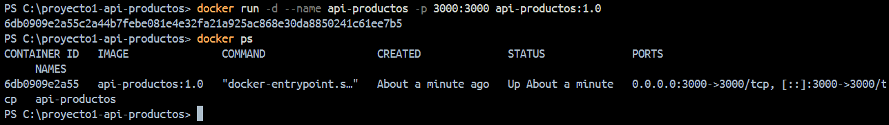

### Endpoints
Listar productos
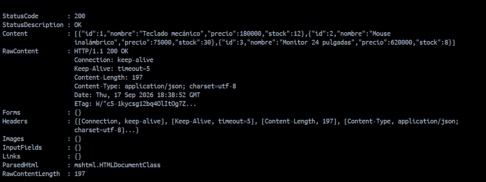
Obtener producto por id
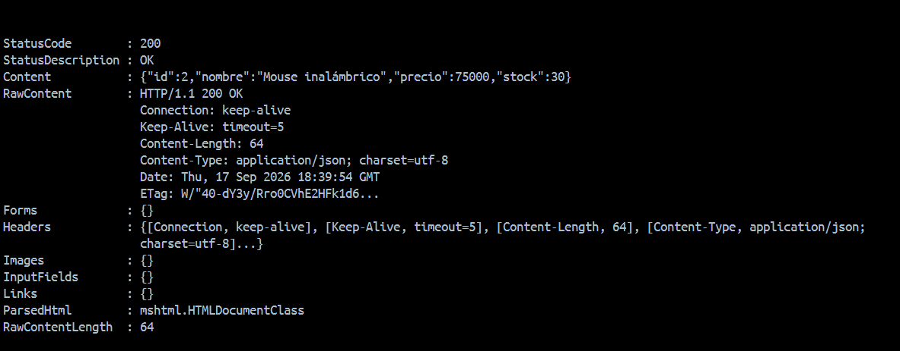
Crear producto
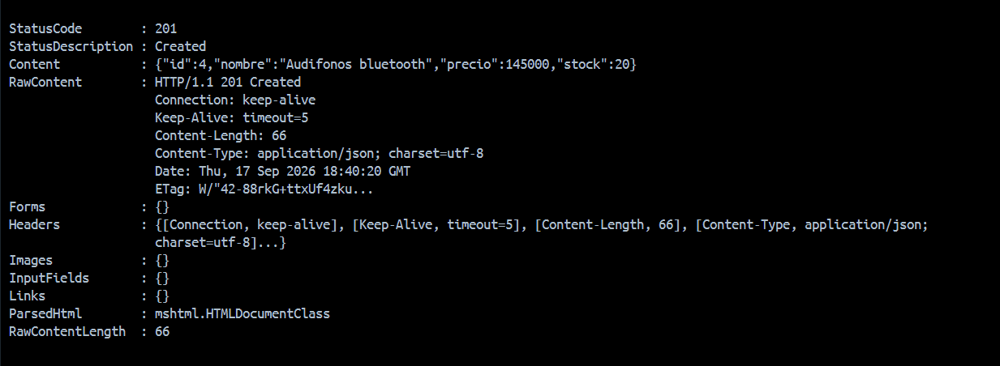
Actualizar producto
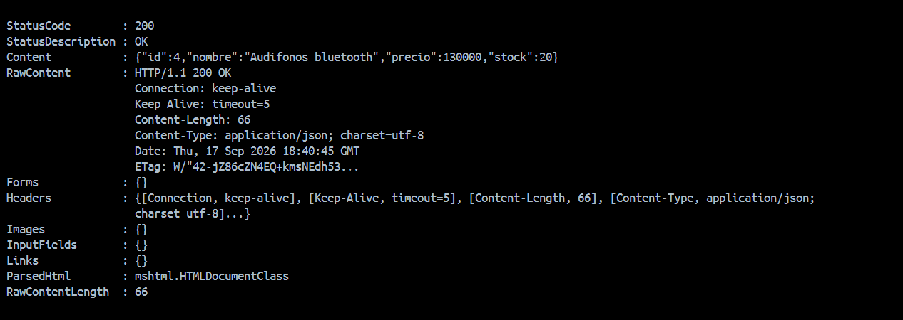
Eliminar producto
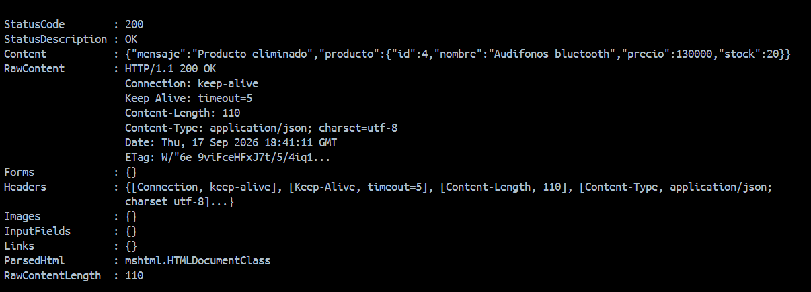

### Ciclo de vida
Logs
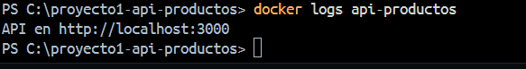
Inspect
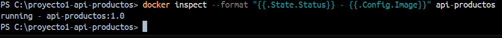
Stop y delete
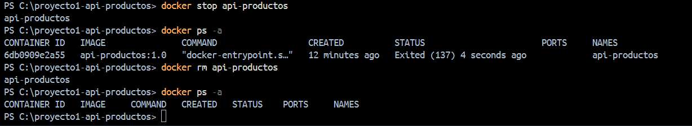

